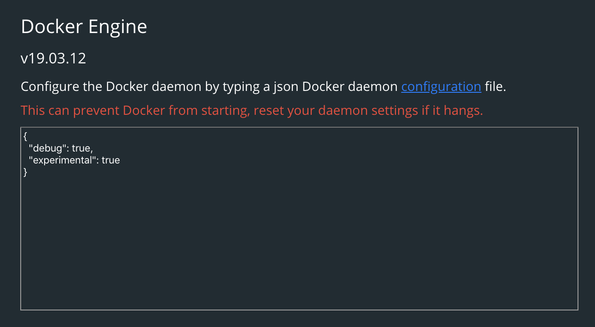

## Background

올해 4월경, 라즈베리파이(ARM 머신)에서 돌아갈 프로그램을 완성하고 Dockerfile도 모두 작성해서 빌드하고 두근두근하며 테스트용 라즈베리파이에서 실행시켜봤습니다.

그랬더니 다음과 같은 난감한 에러만이 저를 반겨줬습니다...

> standard_init_linux.go:211: exec user process caused “exec format error”

열심히 구글링을 해보니 여러 문제가 있지만 (인코딩, CRLF 포맷 등) 빌드한 시스템의 CPU 아키텍처와 실행할 시스템의 CPU 아키텍처가 다를 때에도 저 에러메시지가 뜬다는군요.

제가 개발한 시스템은 맥북프로 13인치(2019형)였고, 실행시킨 환경은 라즈베리파이였으니 납득할만 이유입니다. 그래서 방법을 찾아봤습니다.

`how to build docker image for arm`로 검색을 해보면 docker 공식 블로그 글이 나옵니다.

* [Building Multi-Arch Images for Arm and x86 with Docker Desktop](https://www.docker.com/blog/multi-arch-images/)
* [Getting started with Docker for Arm on Linux](https://www.docker.com/blog/getting-started-with-docker-for-arm-on-linux/)

다행히도 희귀한 케이스가 아니라 공식 블로그에서도 가이드를 제공해주는 내용이기 때문에 차근차근 따라해보기로 했습니다.

## Docker buildx

https://docs.docker.com/buildx/working-with-buildx/

여러 builder를 사용할 수 있게 해주는 [Buildkit](https://github.com/moby/buildkit)의 기능을 Docker cli에서도 사용할 수 있게 해주는 실험적 확장기능이라고 합니다.

## 로컬에서 빌드해보기

일단 Experimental feature이기 때문에 별도로 enable 시켜줘야합니다. 



macOS Docker desktop에서는 이런 식으로 활성화시켰습니다.

그리고 다음과 같이 새로운 buildx를 생성&사용 해주고, 이미지를 빌드할 때 어떤 Platform을 대상으로 할 것인지 지정해주고 빌드하면 됩니다.
```bash
$ docker buildx create --use --name mybuilder
mybuilder
$ docker buildx build --platform linux/arm/v6,linux/arm/v7 .
```

그리고 빌드한 결과물을 테스트 머신에서 돌려보니 성공적으로 동작했습니다! 야호! 이제 CI에서 동작하도록 설정해주면 됩니다.

## Gitlab CI에서 빌드해보기

검색을 해보니 한 [Stackoverflow 답변](https://stackoverflow.com/a/58618830)에서 제가 딱 필요한 ci script를 찾았습니다.

```yaml
buildx:
  image: docker:19.03-git
  stage: buildx
  variables:
    GIT_STRATEGY: none
  artifacts:
    paths:
      - buildx
    expire_in: 1 hour
  services:
    - docker:19.03-dind
  script:
    - export DOCKER_BUILDKIT=1
    - git clone git://github.com/docker/buildx ./docker-buildx
    - docker build --platform=local -o . ./docker-buildx

deploy:
  image: docker:19.03
  stage: deploy
  services:
    - name: docker:19.03-dind
      command: ["--experimental"]
  before_script:
    - mkdir -p ~/.docker/cli-plugins
    - mv buildx ~/.docker/cli-plugins/docker-buildx
    - docker run --rm --privileged multiarch/qemu-user-static --reset -p yes
  script:
    - docker login -u gitlab-ci-token -p $CI_JOB_TOKEN $CI_REGISTRY
    - docker buildx create --use --name mybuilder
    - docker buildx build --platform linux/amd64,linux/arm64,linux/arm/v7 --push -t $CI_REGISTRY_IMAGE .
```

docker buildx를 빌드해서 Artifact로 올려서 build할 때 복사해 사용하는 방식입니다.

뒤늦게 찾은 방법인데, 빌드하는 방식 이외에도 `docker:dind`에 `command: ["--experimental"]`를 줘서 docker buildx를 enable할 수도 있다는데 시도해보지 않아 잘 작동할지는 모르겠네요. (이 방법이 궁금하시면 https://gitlab.com/gitlab-org/gitlab-foss/-/issues/41488 여기를 참조하세요)


위 방법을 사용해서 Gitlab CI에서 잘 빌드중입니다. 

뭔가 Docker에 대해 막연히 system-independent하다는 인식이 있었는데 이런 부분에 대해서 문제를 겪게 되어서 docker의 구조라든지, gitlab CI에서 사용하는 docker in docker를 살펴본다든지 하는 기회가 되어서 나름 즐거웠습니다. ☺️

### 더 읽어볼 거리
 * 왜 Docker는 multi-architecture support가 필요한가? - https://stackoverflow.com/questions/62293721/why-are-docker-multi-architecture-needed-instead-of-the-docker-engine-abstracti