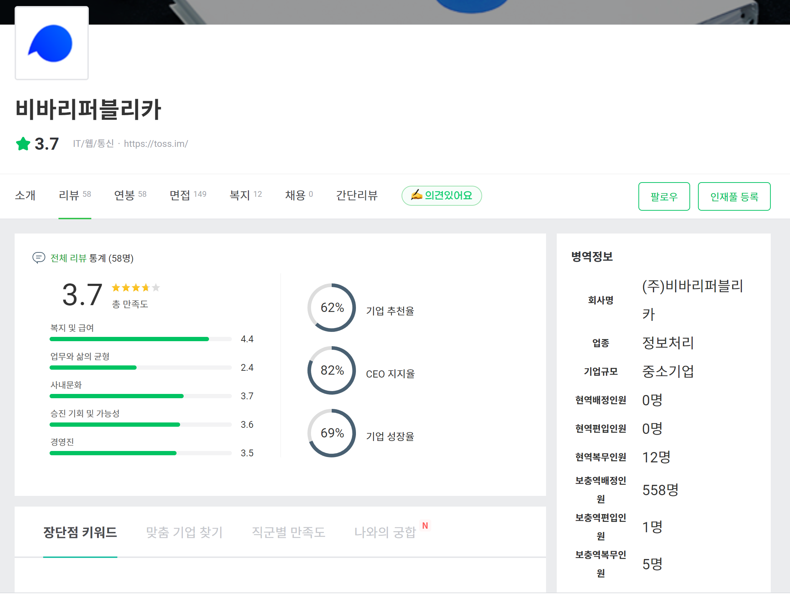
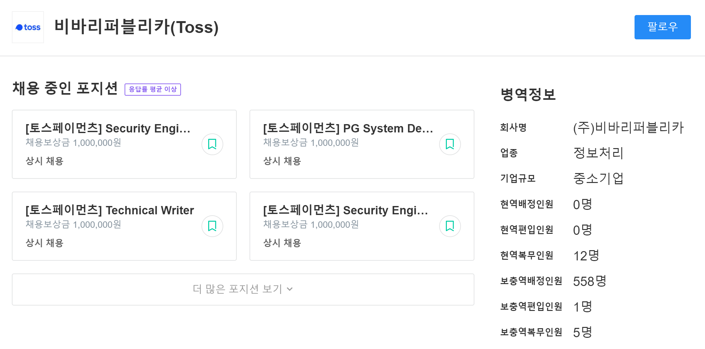

# 프로젝트 소개






로켓펀치, 원티드, 잡플래닛 등 요즘 IT업계에서 특히 많이 사용되고 있는 구인 구직 사이트에서 편하게 해당 업체의 병역지정업체 여부를 보여주는 확장프로그램입니다!

해당 페이지에서 회사 이름을 가져와서 [산업지원 병역일터](https://work.mma.go.kr/) 사이트에 쿼리를 보내 정보를 가져온 후, 보기 쉽게 병역정보 div를 추가해주는 방식이죠! 

* Github : https://github.com/cereme/agento
* Chrome web store : https://chrome.google.com/webstore/detail/agento/ifnibakljlmafjjcbekkmjghggcjkckm?hl=ko&authuser=0

# 이번에 배워간 것

외주라든지, 회사 프로젝트라든지, 이런 성격의 일에서는 항상 최상의 퍼포먼스로 경제성을 신경 써서 작업해야하기 때문에 대개 내가 배울 점을 신경써서 작업하기 힘든데, 토이프로젝트에서는 내가 배우고 싶었던 것, 하고 싶었던 것을 위주로 작업할 수 있어서 재미있습니다.

프론트엔드 개발을 조금씩 하면서 항상 vue-cli라든지, next.js, create-react-app 등에서 사전에 제공된 webpack 템플릿을 사용하기만 했는데, 이번에는 직접 webpack의 필요성(!)을 깨닫고 처음부터 webpack 설정을 해본게 뿌듯하네요.

# Webpack

사실 이전에도 간단한 크롬 확장프로그램을 만들어본 적이 있었습니다. 

다만 그 때는 한가지 종류의 사이트에서 한 가지 종류의 동작만 하면 되었기 때문에 background script(페이지와 별도로 동작하는 스크립트), 그리고 inject script(페이지에 삽입하게 되는 스크립트) 각각 한 종류씩만 작성해서 bundling해서 배포했습니다.

하지만 이번에는 원티드, 로켓펀치, 잡플래닛 이 세가지 종류의 사이트를 감지할 것이고 또 그 안에서도 페이지 종류가 나뉘기 때문에 뭔가 디자인 패턴을 적용해서 잘 설계해야 나중에 코드를 수정할 때 골머리를 덜 앓겠다 싶은 생각이 들었죠.

```javascript
  "content_scripts": [{
      "matches": [
          "*://*.wanted.co.kr/*",
          "*://wanted.co.kr/*"
      ],
      "all_frames": true,
      "js": [
          "src/utils.js",
          "src/vendors/wanted.js",
          "src/strategyFactory.js",
          "src/inject.js"
      ],
      "run_at": "document_end"
    }
  ],
```
(manifest.json 내용 중 일부분입니다. matches 안의 패턴에 일치하는 문서에 대해서 js 파일들을 삽입하겠다는 뜻입니다.)

strategy factory 패턴을 적용해서 이런 식으로 작성하면 되겠다 싶었는데, "js" Array의 순서에 따라서 에러가 발생하는겁니다!

`utils.js`에 `Strategy` 클래스의 정의가 있고, `vendors/wanted.js`에 `Strategy` 클래스를 상속받은 각각 페이지의 구현이 있고, `strategyFactory.js`에 각 페이지에 어떤 `Strategy` 클래스의 구현체가 패밍되어야할 지 정해주는 팩토리 메소드가 있고, 최종적으로 `inject.js`가 페이지에 삽입되는 형식이기 때문에, 저 순서로 로딩을 할 수 있도록 `manifest.js`를 작성해주니 제대로 동작하긴 했습니다.

그래서 열심히 구글링을 한 후, webpack 적용을 시작해봤습니다.

```diff
@ src/inject.js
+ import {strategyFactory} from './strategyFactory';

@ src/strategyFactory.js
+ import { WantedCompanyPageStrategy } from './vendors/wanted';
...
+ export {
+   strategyFactory
+ } 

@ src/utils.js
+ export {
+   Strategy,
+   getElementByXpath,
+   waitUntilElementExistsBySelector,
+   waitUntilElementExistsByXPath
+ } 

@ src/vendors/wanted.js
+ import { Strategy, waitUntilElementExistsByXPath, getElementByXpath } from '../utils';

+ export {
+   WantedCompanyPageStrategy
+ } 
```

일단 이렇게 ES6 module 방식을 적용해서 어떤 모듈에서 어떤 모듈을 참조하는 지 명확히 webpack이 알 수 있도록 설정해주었습니다.

그리고 `webpack.config.js`에 이렇게만 설정해주면 webpack에서 의존성을 잘 따라가서 단일 bundled js파일을 빌드 해줍니다!

```javascript
    entry: {
        'content-script': './src/inject.js',
        background: './src/background.js'
    },
```

맨날 preset webpack 설정만 봤지, 만드는건 처음이라 이것저것 만들어보기도 했습니다.

```javascript
    module: {
        rules: [
            {
                test: /\.(js|jsx)$/,
                use: 'babel-loader'
            }
        ]
    },
```

이렇게 babel도 붙여보고,

```javascript
    if(args.mode === "development"){
        config.watch = true;
        config.plugins.push(
            new ChromeExtensionReloader({
                port: 9039,
                reloadPage: true,
                entries: {
                    contentScript: 'content-script',
                    background: 'background'
                }
            })
        );
    }
```

webpack을 개발하는 도중, 손쉽게 hot-reload를 적용해주는 [Webpack Chrome Extension Reloader](https://www.npmjs.com/package/webpack-chrome-extension-reloader)를 발견해서 적용해보기도 했습니다.

```javascript
    plugins: [
        new CopyPlugin({
            patterns: [
                { from: 'src/index.html', to: 'index.html'},
                { from: 'src/index.css', to: 'index.css'},
                { from: './icon128.png', to: 'icon128.png'},
            ]
        })
    ],
```

CopyPlugin을 사용해서 static file도 복사했죠. 물론 production mode로 빌드하면 바로 Chrome web store에 올릴 수 있도록 zip파일로 번들링 하는 기능도 만들었습니다!

그래서 덮어놓고 쓰던 webpack이란 도구가 사실 되게 customizable한 도구이고, 널리 배포된 정교하게 만든 webpack 설정은 잘 모르는 사람들도 잘 쓸 수 있게 만든 대단한 결과물이라는 점을 깊게 느꼈습니다...

# Browser extension에 대한 사소한 사실들

## TapUpdated

content-script는 기본적으로 페이지가 이동할 때마다 호출됩니다.

그러면 SPA(Single Page Application)에서는 어쩌죠? (사실 SPA에서만이 아니라, Multi Page Application에서도 AJAX를 통해 중요한 정보를 로딩하는 사이트가 있기 때문에 MPA에서도 발생하는 문제입니다.)

https://stackoverflow.com/questions/34957319/how-to-listen-for-url-change-with-chrome-extension

background.js `chrome.tabs.onUpdated` 이벤트 핸들러를 다음과 같이 작성해서, 

```javascript
chrome.runtime.onInstalled.addListener(function() {
  chrome.tabs.onUpdated.addListener(function (tabId, changeInfo) {
    if (changeInfo.status === 'complete') {
      chrome.tabs.sendMessage(tabId, {
        message: 'TabUpdated'
      });
    }
  })
});
```

inject할 스크립트에서 `TabUpdated` 메시지를 받으면 다시 회사 정보를 파싱해서 업데이트 할 수 있도록 작성했습니다

```javascript
chrome.runtime.onMessage.addListener(function (request) {
  if (request.message === 'TabUpdated') {
    let strategy = strategyFactory(document.location.href);
    if(strategy){
      strategy.render();
    }
  }
});
```

## 크롤링은 어떻게 해온거죠?

혹시 맨 위에서 설명한 구현방식을 보시고 *CORS에 걸리지 않을까?* 생각하셨을 수도 있습니다.

병무청에서 제공하는 공식 Open API를 사용한 것이 아니라 페이지에 요청을 보내 파싱하는 방식이기 때문이죠. 

(사실 Open API를 사용하는 식으로 가려고 했지만 https://data.go.kr 에서 열심히 뒤져봐도 최신화된 데이터를 찾을 수 없었습니다.)

하지만, background script에서 보내는 XHR 요청은 Same origin policy를 적용받지 않습니다.

> Extension origins aren't so limited - a script executing in an extension's background page or foreground tab can talk to remote servers outside of its origin, as long as the extension requests cross-origin permissions.

자세한 내용은 https://developer.chrome.com/extensions/xhr 를 참고해주세요

# 마무리

특정 페이지에서 외부의 리소스를 가져와 추가로 알고싶은 정보를 한 페이지에서 제공해줄 수 있다는 아이디어는 [solved.ac](https://solved.ac/)에서 영감을 받았습니다. 감사드립니다 🙏

여러분들도 어떤 정보를 얻기 위해 두 번 검색한 경험이 있다면 크롬 확장프로그램을 만들어보아요!

끝까지 읽어주셔서 감사합니다 :)