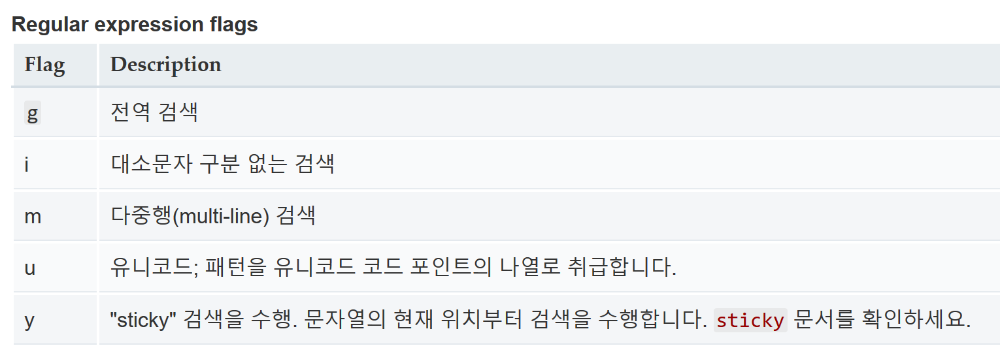

2019년 03월 06일, 학생회 사물함 배정 솔루션 "사물함호랑이"를 처음으로 실사용했다.
사이드 프로젝트였고, 다른 프로젝트때문에 시간이 없어 테스트를 거의 못했다.

그래서 나온 실수 2가지 중 한가지를 포스팅해본다.

파이썬에서는 replace가 string 안의 모든 일치하는 substring을 대체해준다.
~~~python
>>> s = '010-1234-5678'
>>> s.replace('-','')
'01012345678'
~~~

그런데 자바스크립트는 그렇지 않다.
~~~javascript
>> let s = '010-1234-5678';
undefined
>> s.replace('-','');
"0101234-5678"
~~~

메소드들을 살펴보니, replaceAll같은 메소드는 없다...

흠... 그래서 검색해본 결과
~~~javascript
>> let s = '010-1234-5678';
undefined
>> s.replace(/-/g,'');
"01012345678"
~~~

이렇게 regex에 global 태그를 주면 된다는 사실을 알았다.

https://developer.mozilla.org/ko/docs/Web/JavaScript/Guide/%EC%A0%95%EA%B7%9C%EC%8B%9D#%ED%94%8C%EB%9E%98%EA%B7%B8%EB%A5%BC_%EC%82%AC%EC%9A%A9%ED%95%9C_%EA%B3%A0%EA%B8%89%EA%B2%80%EC%83%89

