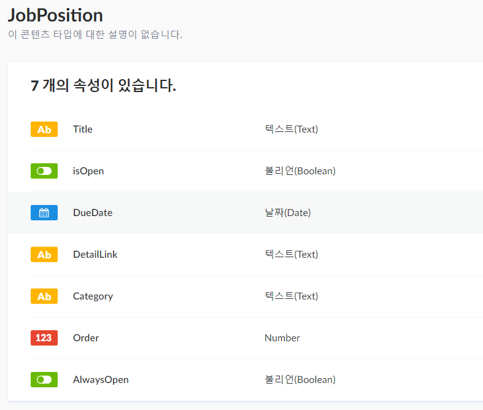
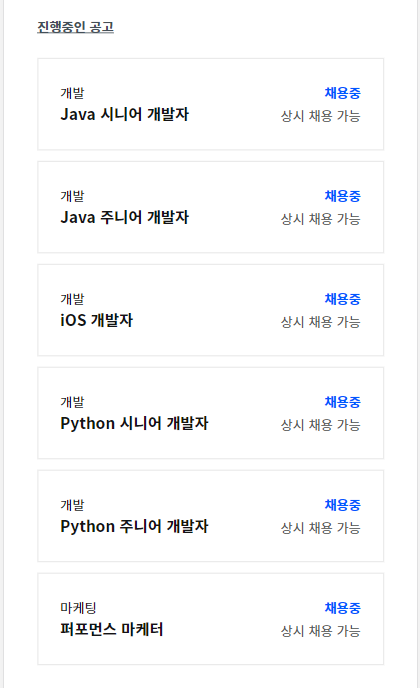

## 배경

최근 프론트엔드 동료님께서 [회사 홈페이지](https://www.herrencorp.com/)를 새로 만드는 작업을 하셨는데, 프론트엔드 동료로서 만드는데 참견을 좀 할 기회가 있었습니다.

기획서와 퍼블리싱 초안을 보고 가장 먼저 눈에 들어온 것은 "채용공고" 섹션이 있고, 채용공고에 변동이 있을 때 마다 마크업을 수정해서 재배포를 하겠다는 설명이였습니다...

도저히 참을 수 없어서 회사 홈페이지 기획을 맡아주신 동료님께 가서 "이 부분을 계속 개발팀이 마크업을 새로 만들고 배포하는 식으로 가면 상당히 피로가 심할 것 같습니다. 백엔드를 적용하는게 어떨까요?"라고 여쭤봤는데 다음과 같은 대답이 돌아왔습니다.

> "근데 백엔드 만들어서 붙이려면 또 며칠 이상씩 걸리잖아요?"

당시에 SNS, 뉴스레터에서 strapi를 접하고 한 번 써볼 기회를 노리고 있던 터라 바로 대답했습니다.

> "아뇨, 하루 안에 됩니다."

## 세팅

아마 트래픽이 폭증할 리는 없을테니(...) ec2 인스턴스를 만들고 strapi를 설치했습니다.

간단하게 기획으로부터 요구사항을 뽑아내고, 엔티티가 "채용공고" 하나뿐이기 때문에 빠르게 모델링을 했습니다.

요구사항 중 채용공고를 삭제하지 않고 노출이 되지 않게 하는 부분은 strapi 공식 문서의 [Draft system](https://strapi.io/documentation/3.0.0-beta.x/guides/draft.html)을 보고 구현(복붙)했습니다.

그리고 Permission plugin에 가서 만든 모델(Collection type)의 접근 권한을 Public으로 풀어준 후, 프론트엔드 동료님께 API Endpoint를 전달해드리면 끝입니다!

## 결과물

결론적으로 몇 시간도 채 사용하지 않고, 운영팀은 잘 정돈된 Dashboard를 통해 채용공고를 CRUD할 수 있으며 프론트엔드에서는 간단하게 JSON으로 채용공고를 받아서 렌더링할 수 있는 괜찮은 Headless CMS가 완성되었습니다.

스크린샷 상의 [Python 시니어 개발자](https://www.rocketpunch.com/jobs/72187/%ED%83%84%ED%83%84%ED%95%9C-%EC%8A%A4%ED%83%80%ED%8A%B8%EC%97%85%EC%97%90%EC%84%9C-Python-%EC%8B%9C%EB%8B%88%EC%96%B4-%EA%B0%9C%EB%B0%9C%EC%9E%90-%EA%B5%AC%EC%9D%B8), [Python 주니어 개발자](https://www.rocketpunch.com/jobs/81766/%ED%83%84%ED%83%84%ED%95%9C-%EC%8A%A4%ED%83%80%ED%8A%B8%EC%97%85%EC%97%90%EC%84%9C-Python-%EC%A3%BC%EB%8B%88%EC%96%B4-%EA%B0%9C%EB%B0%9C%EC%9E%90-%EA%B5%AC%EC%9D%B8) 포지션은 제가 일하는 팀의 포지션입니다! 혹시 흥미 있으시면 지원 부탁드립니다! 이 이외에도 저희 팀 포지션 채용이나 회사에 대해 여쭤보고싶으신 부분이 있다면 편하게 연락 부탁드립니다. :)

## 후기

컨텐츠 등록은 strapi의 기본 dashboard를 통해서, 그리고 endpoint는 단 하나인 사실상 가장 간단한 strapi 사용례를 구현했지만, 만지다보니 이것보다 꽤 더 복잡한 경우도 시간을 거의 들이지 않고 빠르게 만들 수 있겠구나 싶었습니다. 

앞으로 토이프로젝트를 하는데 이런 Headless CMS스러운 기능이 필요해진다면 가장 먼저 고려하게 될 것 같습니다.