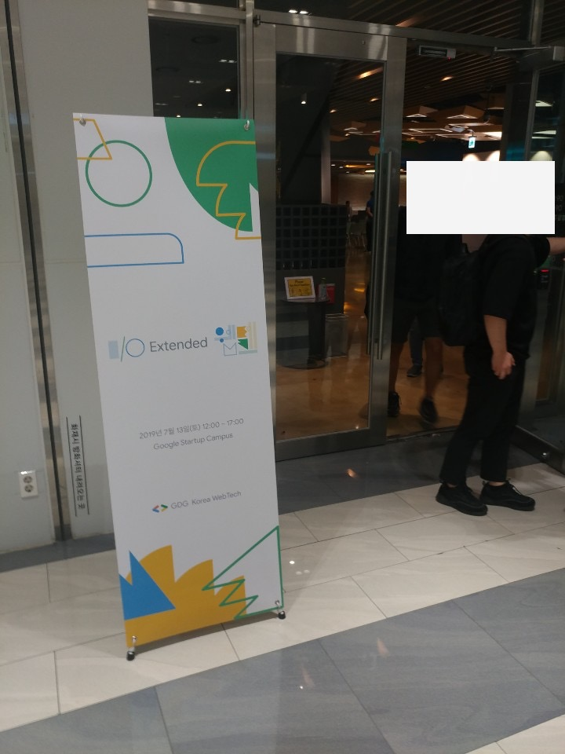
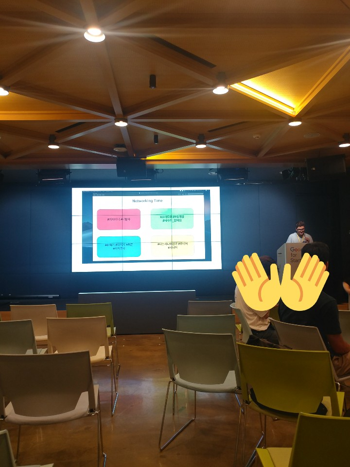

Google I/O Extended 2019 Webtech에 다녀왔습니다!



사진을 잘 안찍어버릇해서 나올 때 찍었습니다...

## Puppeteer: Getting Started

Selenium처럼 Web automation tool인 [Pupeteer](https://github.com/GoogleChrome/puppeteer)를 시작해보는 세션이였습니다.

Pupeteer의 특징은 다음과 같다고 하네요
 * Chrome만 지원
 * Google Chromium 팀이 직접 maintain
 * Node.js만 지원

라이브코딩으로 Google Account에 로그인하는 과정을 보여주셨습니다!
또, 예제로 Jest + Puppeteer e2e testing, Crawling 등의 예제를 보여주셨습니다.

Selenium보다 DOM Waiting도 간편해서 좋은 것 같습니다. 또한 User action을 직접 간단하게 보낼 수 있는 것도 좋네요.

## Hands on Portals

처음 들어본 주제다!

Micro Frontends에 대한 소개와 함께 시작했다. MSA의 개념을 Frontend에 확장한 개념이다.

개발조직이 분리되어있는(혹은 Legacy가 많은) 서비스에서 여러 다른 Frontend Framework를 동시에 사용할 수 있게 하는 것이다.

방법론이다보니 이를 구현하기 위한 방법이 많이 있다.

 * Domain 분리
 * javascript isolation

근데 "개빡셉니다" 라고 한다 ㅋㅋ 당연히 완전히 page를 isolate하는건 품이 많이 들어가겠지...
=> *어떤 방식을 사용해도 결국 어렵다!*

그리고 이제 드디어 Portal 얘기가 나온다.

Page 이동의 단점 : "현재 페이지를 벗어난다" (naver.com의 로그인 버튼처럼)

=> portal은 페이지 이동을 부드럽게 보여주는 HTML Element이다! HTML 표준이래요. 하지만 Google Chrome에서만 지원(...) 게다가 Chrome Canary에서 Flag를 활성화시켜야먄...

iframe처럼 portal도 postMessage API를 사용해서 통신할 수 있다. 확실히 Micro Frontends를 잘 사용할 수 있는 예제였다.

## New Capabilities for the Web

"웹의 기능이 어디까지 확장될 수 있니?" 에 대한 세션이다.

### App Gap

현재(2019-07-07 기준) 지구 인구는 약 80억명이고, 인터넷 유저는 약 40억명이라고 한다. -> 브라우저랑 인터넷만 있으면 뭐든지 할 수 있다!

Native App에서는 가능하고, Web에서 할 수 없는 것들을 App Gap이라고 한다. Ex) Local file 접근 등

### Project Fugu

Web이 Native app을 따라가게 하고자 하는 프로젝트.

### New Capabilities

 * Sharing Content and Receiving Shares

기존에 네이티브에서 하던 Share 기능을 Web API 기능으로 구현 

근데 구현되어있는 브라우저가 Safari, Opera밖에 없다...

 * Media Session API

 스마트폰에서 Web 동영상을 볼 때 알림센터에서 Thumbnail 나오고 navigation이 나오는게 이거였구나

 * Shape Detection API

 Face / Barcode / Text Detector -> 웹에서 이미 디바이스에 있는 모듈을 사용할 수 있도록!
 좀 좋은듯?

 * Perception Toolkit

```npm install perception-toolkit``` 으로 쓸 수 있다.

Demo에서는 카메라로 사물을 찍으면 알아서 검색해서 알려주는걸 보여줬는데 좀 멋있었다. 근데 뭔가 제대로 써먹기는 힘들 것 같은 느낌...

 * Screen/System Lock

웹에서 Device가 Sleep하지 않도록 해주는 API

 * Badge API

```ExperimentalBadge.set(1);``` 같은 방식으로 App의 Badge를 켤 수 있다. 이거도 flag에서 enable해야됨

## WebAssembly 101
가장 기대되는 세션!

### Emscripten
LLVM 바이트코드를 JavaScript로 컴파일해주는 프로젝트

### asm.js
JS에서 Object, String, Closure, Dynamic type같은 것들을 빼고 만든 Subset. 그러면 거의 C언어와 유사한 JS 코드가 되고 Assembly와 유사한 컴퓨팅방식을 사용 가능하다고 한다.

### WebAssembly
asm.js로부터 발전해서 새로 정의한 Web을 위한 Assembly
> *WebAssembly is a binary instruction format.*

Emscripten의 출력물은 Optimized JS -> asm.js -> WebAssembly binary로 변화했다고 한다

### Usage
 * https://squoosh.app/ - Image editing tool인데 Web assembly를 사용해서 구현. [Github Repo](https://github.com/GoogleChromeLabs/squoosh)를 보면 이미지 압축 알고리즘 cpp 코드를 wasm로 만든 것을 볼 수 있다. Rust도 wasm도 컴파일 할 수 있다. Rust Compiler에서 wasm 컴파일러를 지원한다고 한다.

 * https://github.com/torch2424/wasmboy - Gameboy 에뮬레이터. TypeScript도 wasm으로 컴파일 할 수 있는 case. 대신에 AssemblyScript라는 TypeScript의 Subset을 사용하면 가능하다고 한다. Compiler는 Binaryen. 근데 TS의 엄격한 Subset이라고 하면 차라리 C++이 낫지 않나 싶긴 하다. AssemblyScript의 스펙에 대해 설명을 자세히 해주셨는데 들으면 들을수록...

### Next features
* Thread/Shared Memory
* ES6 module Integration
* GC
* More languages ( https://github.com/appcypher/awesome-wasm-langs ) 

근데 솔직히 나는 쓸 일이 없을것 같다... 어썸하긴 하지만 ㅎ

## Going BIG - PWA
Chrome 76부터는 Desktop에서도 PWA가 된다고 한다.
Mobile/Desktop 모두 된다는건 상당히 매력적이다. Major browsers들은 모두 지원하기도 하고.

라이브 버그리포팅 들어와서 고치느라 잘 못들었음 ㅠ

## Deep in Lighthouse Audits
세션 제목만 보고 Lighthouse 써봤는데 좋더라구요

* 최악의 상황에서 50점이 나오는게 최선의 상황에서 100점이 나오는거보다 낫다! -> 자기만족에서 끝내지 말자... 

세션 듣기 전에 Lighthouse 돌릴 때, Throttling 걸어서 점수가 진짜 끔찍하게 나왔는데 Throttling 풀고 자기만족 했었는데 그부분 딱 말씀하셔서 웃겼다 ㅋㅋ

* web.dev 에서 권장사항들 확인 가능

* 100점은 많이 어려우니까 KPI 느낌으로 

## 네트워킹 세션



주제별로 나눠서 네트워킹하는 세션이 맨 마지막이였다.

센스있게 그룹을 나눠주셔서 재밌는 시간이 되었다 ㅎㅎ

---

다음부터는 세션마다 사진을 하나 이상씩은 찍어야겠습니다. 글이 너무 휑하네요 ㅠ

여러 개발자분들이 개발하시는 이야기, 새로운 기술에 대한 이야기를 나누니까 좀 리프레시가 되는 기분입니다. 

다음달에는 Pycon!!